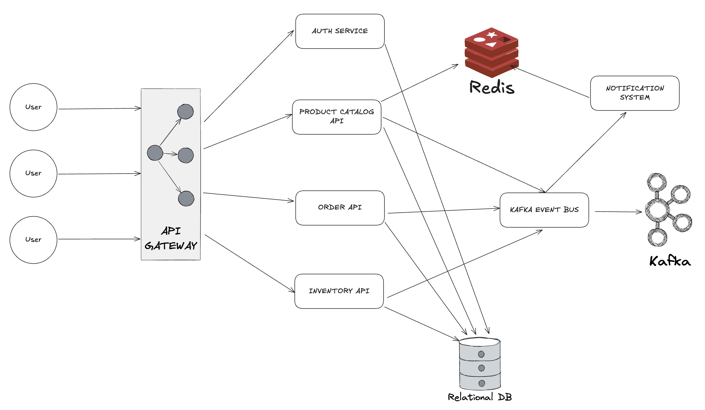

# System design

## System Requirements and Boundaries

### Functional Requirements

**Product Management**
- CRUD for product information
- Manage product categories and attributes
- Track product stocks
- Set inventory threshold for alerts

**Order Management**
- Create and process customer orders
- Track order status through various states
- Manage order fulfillment process
- Support for order cancellations and returns

**Inventory Management**
- Real-time inventory tracking
- Manage stock reservations during checkout
- Trigger replenishment alerts when stock is low
- Support for multiple warehouses

**Notiication System**
- Send alerts for inventory changes
- Notify relevant parties about order status changes
- Support for email and in-app notifications (SMS optional)
- Configurable notification templates

**User Management**
- Authentication and authorization
- User role management (admin, warehouse staff, etc.)
- User preferences for notifications

### Non-Functional Requirements

**Performance**
- Handle peak loads of 1000+ concurrent users
- Process order transactions in under 1 second
- API response times < 300ms for most operations

**Scalability**
- Horizontal scaling of services
- Ability to handle 10x growth in transaction volume

**Reliability**
- 99.9% uptime for core services
- Graceful degradation under heavy loads
- Resilient to infrastructure failures

**Security**
- Secure API endpoints with Authentication
- Encrypt sensitive data
- Audit logging for all important operations

**Data consistency**
- Eventually consistent data model
- Transactional integrity for critical operations

## System Architecture Diagram

## Service Description

1. **API Gateway**
    - Entry point for all client requests
    - Routes requests to appropriate microservices
    - Authentication and request validation
    - Rate limiting and circuit breaking
    - Technology: .NET 8 with YARP or Ocelot
2. **Product Catalog Service**
    - Manages product information and metadata
    - Handles product categorization
    - Product search and filtering
    - Caches product information in Redis
    - Technology: .NET 8 API, SQL Server, Redis
3. **Inventory Service**
    - Tracks inventory levels in real-time
    - Manages stock reservations and releases
    - Handles threshold alerts for low stock
    - Publishes inventory events to Kafka
    - Technology: .NET 8 API, SQL Server, Kafka
4. **Order Service**
    - Processes customer orders
    - Manages order workflow and state transitions
    - Coordinates with Inventory for stock validation
    - Publishes order events to Kafka
    - Technology: .NET 8 API, SQL Server, Kafka
5. **Notification Service**
    - Consumes events from Kafka
    - Manages notification templates
    - Sends notifications via multiple channels
    - Tracks notification delivery status
    - Technology: .NET 8 API, Redis, Kafka
6. **Auth service**
    - User authentication and authorization
    - Role-based access control
    - JWT token issuance and validation
    - Technology: .NET 8 API, SQL Server

## Event Flow Design

### Core Event Types

1. **Product Events**
   - `ProductCreated`
   - `ProductUpdated`
   - `ProductDeleted`
   - `ProductPriceChanged`
2. **Inventory Events**
   - `InventoryChanged`
   - `InventoryReserved`
   - `InventoryReleased`
   - `InventoryThresholdReached`
3. **Order Events**
   - `OrderCreated`
   - `OrderStatusChanged`
   - `OrderPaymentReceived`
   - `OrderCancelled`
   - `OrderFulfilled`
4. **Notification Events**
   - `EmailNotificationRequested`
   - `SmsNotificationRequested` (optional)
   - `PushNotificationRequested`
   - `NotificationDelivered`
   - `NotificationFailed`

### Event Processing Patterns

1. **Command-Query Responsibility Segregation (CQRS)**
   - Separate read and write operations
   - Use events for write operations
   - Maintain read-optimized views
2. **Event Sourcing**
   - Store events as the source of truth
   - Rebuild state by replaying events
   - Use snapshots for performance
3. **Saga Pattern**
   - Coordinate transactions across services
   - Compensating transactions for failures
   - State machine for complex workflows

## API Design

### RESTful API Standards

- Use plural nouns for resource collections
- Use HTTP methods correctly (GET, POST, PUT, DELETE)
- Return appropriate HTTP status codes
- Use consistent naming conventions
- Include version in URI path

### Sample API endpoints

**Product Service**
- `GET /api/v1/products` - List all products
- `GET /api/v1/products/{id}` - Get product by ID
- `POST /api/v1/products` - Create new product
- `PUT /api/v1/products/{id}` - Update product
- `DELETE /api/v1/products/{id}` - Delete product
- `GET /api/v1/categories` - List all categories

**Inventory Service**
- `GET /api/v1/inventory` - List all inventory items
- `GET /api/v1/inventory/{productId}` - Get inventory for product
- `POST /api/v1/inventory/reserve` - Reserve inventory
- `POST /api/v1/inventory/release` - Release reserved inventory
- `POST /api/v1/inventory/adjust` - Adjust inventory levels

**Order Service**
- `GET /api/v1/orders` - List all orders
- `GET /api/v1/orders/{id}` - Get order by ID
- `POST /api/v1/orders` - Create new order
- `PUT /api/v1/orders/{id}` - Update order
- `PUT /api/v1/orders/{id}/status` - Update order status

**Notification System**
- `POST /api/v1/notifications` - Send new notification
- `GET /api/v1/notifications/status/{id}` - Check notification status
- `GET /api/v1/notifications/templates` - List notification templates